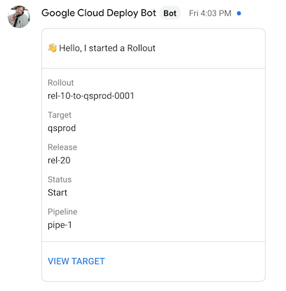
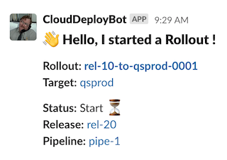

# Google Cloud Deploy Bot
### Push Google Cloud Deploy notifications to Slack or Google Chat! 

This repo is indended as an example, and as a first step, on adding [Google Cloud Deploy](https://cloud.google.com/deploy) to you _ChatOps_ suite of integrations. 

## Examples

## Instructions

1. Have a [Google Cloud Deploy](https://cloud.google.com/deploy) pipeline set up.
2. Create a Google Cloud Function, defining:
    1. Entry point is `CloudFuncPubSubCDOps`.
    2. Environment value `TOKEN` = Slack's bot token or Google Chat Service Account Key JSON data (1).
    3. Environment value `CHANNEL` = Slack's channel id or Google Chat space id.
    4. Environment value `CHATAPP` = values can be `slack` or `google`. 

3. Subscribe to the [clouddeploy-operations](https://cloud.google.com/deploy/docs/subscribe-deploy-notifications) topic on Google Pub/Sub and use the Cloud Function above as a trigger.

---

**Notes**

(1) If you are minimising the Service Account's JSON data be careful about removing all blank spaces as it might break the private key.